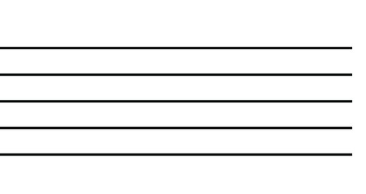

# Appendix A: User Interface Screens

This appendix provides an overview of various user interfaces used in the system. Each interface screenshot is accompanied by a brief description.

## Appendix A.1: After Task Completion Page Interface

Insert description here

## Appendix A.2: Exercises Page Interface - Pressing the Info Button

Insert description here

## Appendix A.3: Exercises Page Interface - Pressing the Third Hint Button

Insert description here

## Appendix A.4: Task Overview Page Interface

Insert description here

## Appendix A.5: Theory Page Interface

Insert description here

## Appendix A.6: Unit Progress Overview Page Interface

Insert description here

## Appendix A.7: Units Overview Page Interface

Insert description here

## **Appendix B. Declarative and procedural knowledge** 

**Table 2: Pairs of Topic and Procedural Skills**

| Unit | Skill  | Topic | Learning material | Assessment material |
| :---- | :---- | :---- | :---- | :---- |
| **Basic notation**  | Identifying clef and its position | Clef | Staff, treble staff, reading music is left to right  | Multiple choice, drag clef on the staff |
|  | Identifying the representation of a note | Introducing the notes (notation) | Note notation, different note representations | Draw the note, draw different note representations |
|  | Identifying notes belonging on/out of  the staff  | Staff, Introducing the notes (notation) | Notes position in the staff and notes outside of the staff  | Drag the notes on or out of the staff  |
| **Notes** | Ordering the notes | Note names and Natural Notes | Notes are in the following order: CDEFGAB | Hide some letters and ask to write it, make students write the full order of notes. What is after/ before a specific note?  |
|  | Identify where each note stands on the staff (first octave)  | Note position on the staff | For each note, identify where it stands on the staff (first octave) | What is the given note on the staff? |
|  | Read and write notes on ledger lines | Ledger Lines | Introduce ledger lines using visuals of notes placed above and below the staff | Ask students to name notes on ledger lines, Ask students to identify how many ledger lines are used for a given note |
|  | Identify where each  note stands on the staff (second octave)  | Octaves | Learn what is an octave (with a video explanation) and for each note, identify where it stands on the staff | What is the given note on the staff?  |
| **Duration** | Recognize  distinct note lengths  | Note duration | Visual chart showing different note lengths and their corresponding symbols,  Interactive flashcards where students click on a note symbol and hear its corresponding sound and length | Connect images of notes with their names, press button for the duration of the note length |
|  | Understand the relationship between distinct note lengths | Note duration | Visual diagram that illustrates how note lengths relate to each other | Present a note value and ask students to select the correct combination of other note values that equals the same duration, Ask students to tap the note lengths based on what they hear |
|  | Recognize distinct pause lengths  | Pauses | Visual chart showing different pause lengths and their corresponding symbols | Connect images of pauses with their names |
|  | Understand the relationship between distinct pause lengths | Pauses | Visual diagram that illustrates how pause lengths relate to each other | Present an incomplete measure with note values and the student fills in the missing pause |
|  | Understand the use of dotted/tied notes | Dotted notes | Explain the effect of dotted/tied notes | Present a note value and ask students to select the correct combination of other note values that equals the same duration, Ask students to tap the note lengths based on what they hear |
|  | Understand the utility of time signatures	 | Time Signatures | Visual explanation of what time signatures are (e.g., 4/4, 3/4, 6/8), breaking down the top number (beats per measure) and the bottom number (note value per beat) | Play short excerpts of music or display a written measure with notes and ask students to identify the correct time signature from a list of options |
| **Accidentals (Sharps and flats)** | Identify the symbols of flat and sharp  | Accidentals | Symbol of flat and sharp and how to read it with the note. They can be both at the signature clef or applied to each note | Given a single note on the staff, what is the name of the note (with alteration)? |
|  | Apply the flats and sharps to all notes present in the same bar  | Key signatures | When accidentals symbol in signature clef, then apply them to all pieces of music. When present on a note (e.g. G) , then apply to all Gs in that bar.  | Recognize if a note has accidentals. Multiple choice, circle the notes.  Explain (multiple choice) why it’s the case.  |
|  | Make a note natural again  | Accidentals | If accidentals symbols are applied and the natural symbol (♮) is in front of the note, everything returns to natural form  | Recognize if a note is accidental or natural. Multiple choice, circle the note. Explain (multiple choice) why it’s the case.  |
| **Solfeggio** | All previous skills, the interaction between multiple previous skills | Solfeggio | Interactive exercise where students can sing along with the app as it plays solfège | Present a simple rhythmic pattern and ask them to sing it back using solfège syllables, Play a melody using solfège and ask the student to write it down |

**Appendix D. Learning material** 

**Table 3: learning material examples** 
|  | Example |
| :---- | :---- |
| 1. | The staff has 5 lines and 4 spaces: |
| 2. | The treble clef is positioned on the second line (from below). |
| 3. | Music notes flashcards: |
| 4. | The notes are in the following order: |
| 5. | The E is on the first line (from below): |
| 6. | Diagram of note durations: |

**Appendix E. Assessment material** 

                *Table 4: assessment material example* 

|  | Example |
| :---- | :---- |
| 1. | How many lines does the staff have? (choose the correct option) 3 4 5 |
| 2. | Drag the clef on the staff  |
| 3. | Fill in the blanks with the order of the notes:  C … E F … A B |
| 4. | What is the note shown on the staff ?    |
| 5. | Fill in the blanks to make each side the same duration:  |
