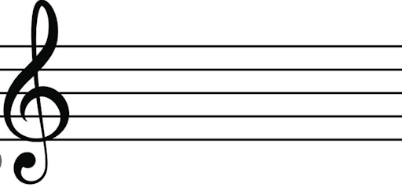
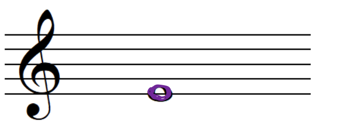

# **Appendix C. Learning material** 

**Table 3: learning material examples** 
|  | Example |
| :---- | :---- |
| 1. | The staff has 5 lines and 4 spaces:  |
| 2. | The treble clef is positioned on the second line (from below).  |
| 3. | Music notes flashcards:  |
| 4. | The notes are in the following order:  |
| 5. | The E is on the first line (from below):  |
| 6. | Diagram of note durations:  |
