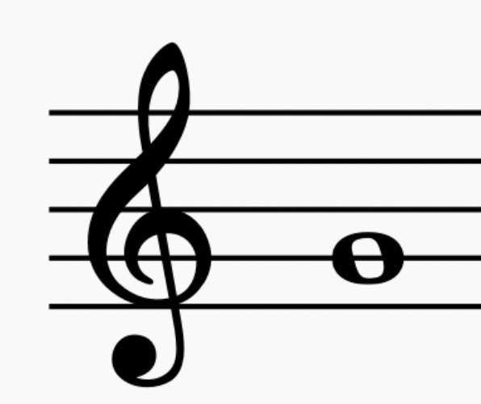
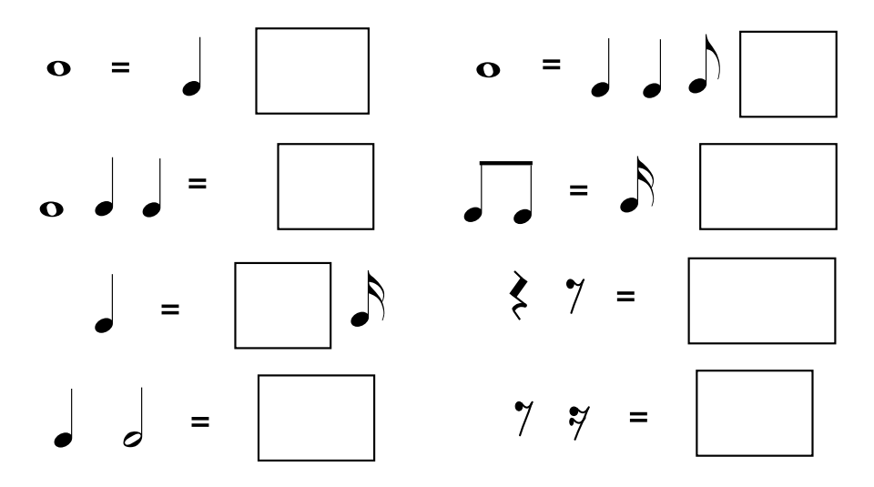

# **Appendix D. Assessment material** 

**Table 4: assessment material example**

|  | Example |
| :---- | :---- |
| 1. | How many lines does the staff have? (choose the correct option) 3 4 5 |
| 2. | Drag the clef on the staff  |
| 3. | Fill in the blanks with the order of the notes:  C … E F … A B |
| 4. | What is the note shown on the staff ?     |
| 5. | Fill in the blanks to make each side the same duration:   |
